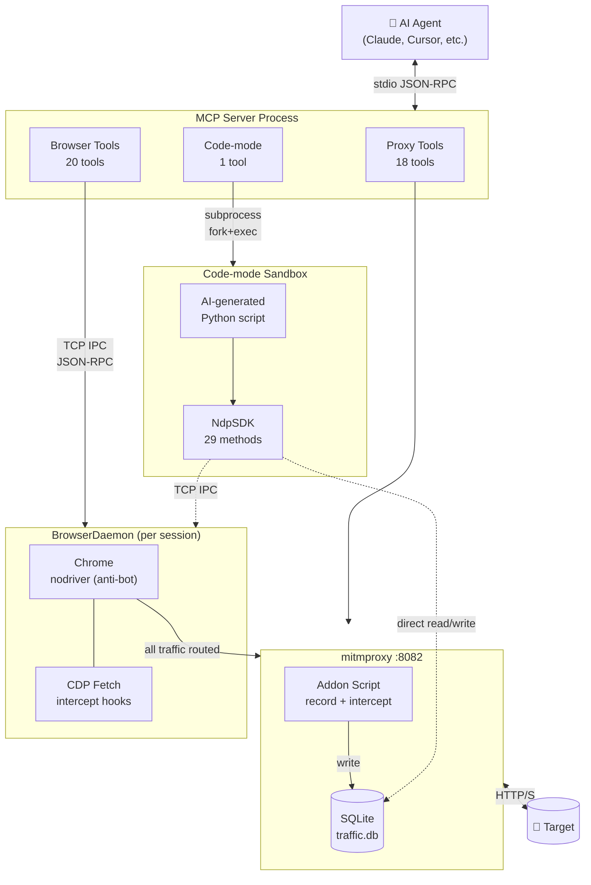
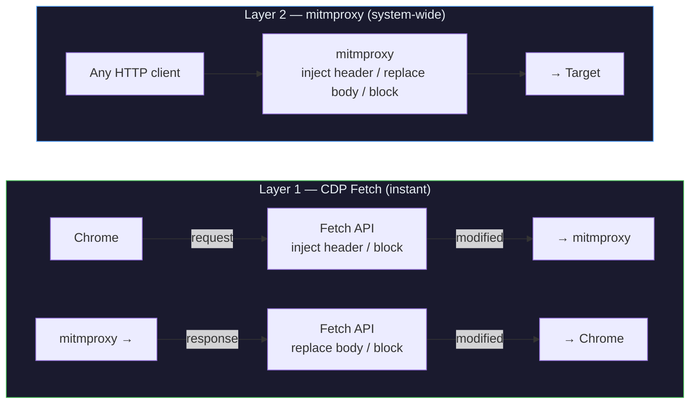

<p align="center">
  <h1 align="center">nodriver-proxy-mcp</h1>
  <p align="center">
    <strong>Give your AI agent a browser, a proxy, and a Python sandbox.</strong><br/>
    It navigates like a human, intercepts like Burp, and codes its own exploits on the fly.
  </p>
  <p align="center">
    <a href="https://python.org"></a>
    <a href="https://modelcontextprotocol.io"></a>
    <a href="LICENSE"></a>
  </p>
</p>

**[한국어](README_ko.md)**


---

## Why this exists

Existing security MCP servers give the AI read-only access to traffic or just wrap CLI tools. This one gives **full, autonomous control**: the agent opens a browser that **bypasses bot detection**, captures every request through a **MITM proxy**, and when the built-in tools aren't enough, it **writes and runs its own Python** to chain everything together.

```
"Scan target.com for IDOR vulnerabilities"

  1. Agent starts proxy + browser
  2. Navigates to login page, types credentials, clicks submit
  3. Captures the auth flow, extracts the JWT
  4. Replays API requests with different user IDs
  5. Writes a Python script to automate the full IDOR check
  6. Reports which endpoints are vulnerable
```

No human touches the keyboard. The agent does it all through 39 MCP tools.


---

## Why pentesters should care

### What can it do that Burp / ZAP can't?

| | Burp Suite / ZAP | nodriver-proxy-mcp |
|---|---|---|
| **Who drives?** | You click manually | AI does everything autonomously |
| **Bot detection** | Blocked by Cloudflare, DataDome, etc. | Bypasses automatically (nodriver) |
| **Scripting** | Write extensions / macros yourself | AI writes Python scripts on the fly, with access to all 38 tools via SDK |
| **Client-side data** | Not visible | Reads localStorage, sessionStorage, JS console, DOM hidden inputs |
| **Can they work together?** | — | Yes — chain through Burp with `upstream="localhost:8080"` |

### What can it do that other security MCP servers can't?

Most security MCP servers just wrap `curl` or read-only traffic viewers. This one has:

- **Real mitmproxy** — full traffic recording, replay, fuzzing, interception rules, session variables. Not a simplified HTTP client.
- **Two ways to modify traffic** — browser-level (instant, CDP Fetch) or proxy-level (system-wide, all HTTP clients). Other MCPs offer neither.
- **Code-mode with SDK** — the AI writes a Python script that runs in a sandbox, calling 29 tools in loops with `asyncio`. Race conditions, blind SQLi, and brute-force that would take thousands of MCP round-trips finish in seconds.

### What it's great at

| Use case | How the agent handles it |
|----------|--------------------------|
| **IDOR** | Opens two browser sessions (victim + attacker), extracts tokens, replays requests swapping user IDs in a loop |
| **XSS** | Types payloads into inputs, clicks submit, checks if `alert()` dialog fires. Inspects DOM for injection points. |
| **Auth bypass** | Scans traffic to detect JWT / API key / session cookie patterns, extracts tokens, replays with modifications |
| **API testing** | Captures all API calls, searches by keyword/status, replays with regex replacement, fuzzes with anomaly detection |
| **Race conditions** | Code-mode sends 50+ concurrent requests via `asyncio.gather()` with precise timing |
| **Blind SQLi** | Code-mode runs binary search extraction — hundreds of conditional requests with logic between each one |
| **CSP bypass** | Intercepts responses at browser level, strips or modifies Content-Security-Policy header before Chrome enforces it |


---

## Architecture

### Overall system



### Two interception layers



> **CDP Fetch** = browser-only, instant, per-session. **mitmproxy rules** = all traffic, ~5s cache delay, system-wide.

### Process lifecycle

| Process | Parent | IPC method | Auto-cleanup |
|---------|--------|------------|-------------|
| **mitmproxy** | MCP server | SQLite (shared file) | Watchdog thread kills on parent death; stderr drain prevents pipe hang |
| **BrowserDaemon** | MCP server | TCP JSON-RPC (dynamic port) | Parent PID watch → IPC close → SIGTERM → SIGKILL |
| **Chrome** | BrowserDaemon | CDP (Chrome DevTools Protocol) | `browser.stop()` on daemon exit |
| **Code-mode script** | MCP server | Env vars (ports, sessions) | Job Object / `killpg`; 256MB RAM, 60s CPU |


---

## NdpSDK — Code-mode Python SDK

`NdpSDK` is a Python wrapper that exposes the same 38 tools (proxy + browser) as async methods, designed for use inside `execute_security_code`. When the AI needs loops, concurrency, or multi-step logic that would be impractical as individual MCP calls, it writes a script using `NdpSDK` instead.

```python
from nodriver_proxy_mcp.sdk import NdpSDK
import asyncio

async def main():
    sdk = NdpSDK()  # auto-discovers running proxy + browser sessions

    flows = await sdk.get_traffic_summary(limit=20)
    await sdk.browser_go("https://target.com/admin")

    # Loops — this is why NdpSDK exists
    for uid in range(1, 100):
        resp = await sdk.replay_flow(
            flow_id,
            replacements=[{"regex": r"/users/\d+", "replacement": f"/users/{uid}"}]
        )
        if resp["status_code"] == 200:
            print(f"IDOR: /users/{uid}")

asyncio.run(main())
```


---

## Quick start

### 1. Install

```bash
pip install nodriver-proxy-mcp
```

Or from source:

```bash
git clone https://github.com/BobongKu/nodriver-proxy-mcp.git
cd nodriver-proxy-mcp
pip install .
```

### 2. Add to your AI agent

**Claude Desktop** (`claude_desktop_config.json`):

```json
{
  "mcpServers": {
    "nodriver-proxy-mcp": {
      "command": "nodriver-proxy-mcp"
    }
  }
}
```

**Claude Code** (`settings.json` or `.claude/settings.local.json`):

```json
{
  "mcpServers": {
    "nodriver-proxy-mcp": {
      "command": "nodriver-proxy-mcp"
    }
  }
}
```

**Cursor / other MCP clients** (`mcp_config.json`):

```json
{
  "mcpServers": {
    "nodriver-proxy-mcp": {
      "command": "nodriver-proxy-mcp"
    }
  }
}
```

### 3. Use it

Just tell your AI agent what to do. The tools are self-descriptive — the agent picks the right ones automatically.


---

## All 39 tools

### Proxy (18)

| Tool | Purpose |
|------|---------|
| `manage_proxy` | Start/stop mitmproxy. Chain to Burp via `upstream`. GUI via `ui=True`. |
| `proxy_status` | Check running state, port, PID |
| `set_scope` | Limit recording to specific domains |
| `get_traffic_summary` | Paginated flow list with IDs, URLs, methods, status codes |
| `inspect_flow` | Full request/response details — headers, body, metadata |
| `search_traffic` | Filter by keyword, domain, method, status code |
| `extract_from_flow` | Pull values via JSONPath, regex, or CSS selectors |
| `extract_session_variable` | Save a value for `{{placeholder}}` reuse in replay |
| `list_session_variables` | Show all extracted variables |
| `generate_curl` | Export a flow as a copy-paste curl command |
| `replay_flow` | Resend with regex replacements + `{{var}}` substitution (like Burp Repeater) |
| `send_raw_request` | Craft arbitrary HTTP requests from raw text (SSRF-protected) |
| `add_interception_rule` | Live proxy traffic manipulation: inject headers, replace body, block |
| `list_interception_rules` | Show active proxy rules |
| `remove_interception_rule` | Delete a proxy rule by ID |
| `detect_auth_pattern` | Auto-detect JWT, Bearer, API key, session cookie, CSRF, OAuth2 |
| `fuzz_endpoint` | Concurrent fuzzing with baseline anomaly detection |
| `clear_traffic` | Wipe the traffic database |

### Browser (20)

| Tool | Purpose |
|------|---------|
| `browser_open` / `browser_close` | Launch or kill a Chrome session (anti-bot bypass, headless by default) |
| `browser_list_sessions` | Active sessions with PID, ports, uptime |
| `browser_list_tabs` | Tabs in a session |
| `browser_go` / `browser_back` | Navigate, wait for page load, SPA support via `wait_for` |
| `browser_click` | Click by CSS selector or visible text. Returns JS alert dialogs (XSS detection). |
| `browser_type` | Type into inputs — login forms, search boxes, payload injection |
| `browser_get_dom` | Security-focused DOM: forms, scripts, iframes, comments, event handlers, `data-*` attributes |
| `browser_get_text` | Text content from any CSS selector |
| `browser_get_storage` | Dump localStorage + sessionStorage (invisible to proxy) |
| `browser_get_console` | JS console output — stack traces, debug URLs, CSP violations |
| `browser_screenshot` | Capture page as PNG — bot challenges, evidence, state verification |
| `browser_set_cookie` | Set cookies via CDP (supports httpOnly — unlike document.cookie) |
| `browser_js` | Execute arbitrary JavaScript in page context |
| `browser_wait` | Wait for element/text to appear (SPA/AJAX support) |
| `browser_intercept_request` | CDP Fetch: inject headers, block outgoing requests (instant) |
| `browser_intercept_response` | CDP Fetch: replace response body, block responses (instant) |
| `browser_intercept_disable` | Turn off all CDP Fetch interception |
| `browser_list_intercept_rules` | Show active CDP Fetch rules |

### Code-mode (1)

| Tool | Purpose |
|------|---------|
| `execute_security_code` | Run AI-generated Python with `NdpSDK` — programmatic access to all 38 other tools. Sandboxed. |


---

## Burp Suite integration

Use `upstream` to chain mitmproxy through Burp for manual analysis alongside AI automation:

```
manage_proxy(action="start", upstream="localhost:8080")
```

Traffic flows: `Chrome --> mitmproxy (:8082) --> Burp Suite (:8080) --> Target`

Both tools see the same traffic. The AI automates; you analyze in Burp when you need to.


---

## Workflows

### Recon — browse, capture, analyze
```
manage_proxy(action="start")
set_scope(allowed_domains=["target.com", "api.target.com"])
browser_open(proxy_port=8082)
browser_go(url="https://target.com")

# Client-side data invisible to proxy
browser_get_dom()                    # forms, hidden inputs, CSRF tokens
browser_get_storage()                # localStorage / sessionStorage tokens
browser_get_console()                # debug messages, internal URLs

# Traffic analysis
get_traffic_summary()                # all captured requests
detect_auth_pattern()                # JWT, cookies, API keys
```

### IDOR — two sessions, token swap
```
browser_open(session_name="victim", proxy_port=8082)
browser_go(url="https://target.com/login", session_name="victim")
# ... login as victim ...

browser_open(session_name="attacker", proxy_port=8082)
browser_go(url="https://target.com/login", session_name="attacker")
# ... login as attacker ...

extract_session_variable(flow_id="...", regex='token":"([^"]+)', name="victim_token")
replay_flow(flow_id="...", replacements=[{"regex": "victim_token_value", "replacement": "attacker_token_value"}])
```

### XSS — payload injection + alert detection
```
browser_go(url="https://target.com/search?q=<script>alert(document.domain)</script>")
browser_click(selector="#search-btn")
# If XSS fires, the alert() dialog message is returned in the click result
browser_get_console()                # CSP violations
```

### Business logic — price manipulation, coupon reuse, workflow bypass
```
# Capture a normal checkout flow
browser_go(url="https://target.com/checkout")
browser_click(selector="#place-order")

# Find the price parameter in traffic
search_traffic(query="price")
inspect_flow(flow_id="...")

# Replay with modified price / reused coupon code / skipped step
replay_flow(flow_id="...", replacements=[{"regex": '"price":99.99', "replacement": '"price":0.01'}])

# Or use code-mode for multi-step logic abuse
execute_security_code(script_content="""
# Apply same coupon 50 times, check if discount stacks
for i in range(50):
    resp = await sdk.replay_flow(coupon_flow_id)
    print(f"Attempt {i}: status={resp['status_code']}")
""", approved=True)
```

### API fuzzing — automated anomaly detection
```
fuzz_endpoint(
    flow_id="abc",
    payloads=["' OR 1=1--", "<script>alert(1)</script>", "../../../etc/passwd"],
    target_pattern="FUZZ"
)
# Measures baseline, flags status code / length / latency anomalies
```


---

## Troubleshooting

| Problem | Fix |
|---------|-----|
| Browser won't launch | Install Chrome/Chromium. `nodriver` requires a real Chrome binary. |
| SSL certificate errors | Trust the mitmproxy CA: `~/.mitmproxy/mitmproxy-ca-cert.pem` |
| Port already in use | `manage_proxy(port=XXXX)` — or restart, orphaned processes are auto-killed |
| Tools not showing | Restart your Claude Code / Cursor session to reload the MCP server |
| `uvx` doesn't work | Don't use `uvx`. Clone the repo and use `uv run --directory` instead. |


---

## License

MIT
