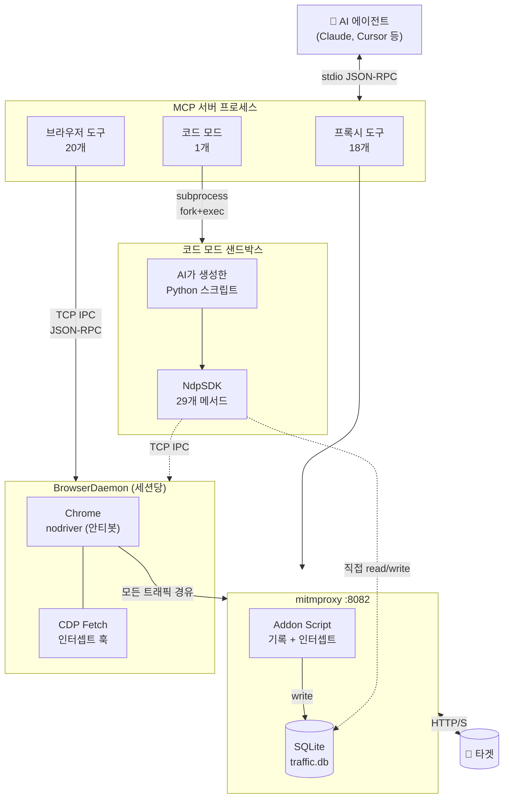
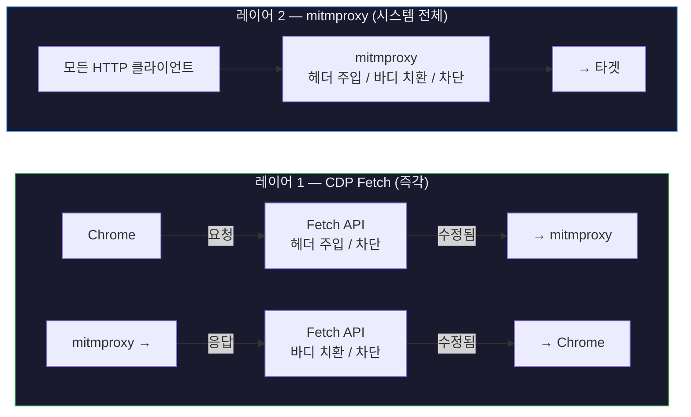
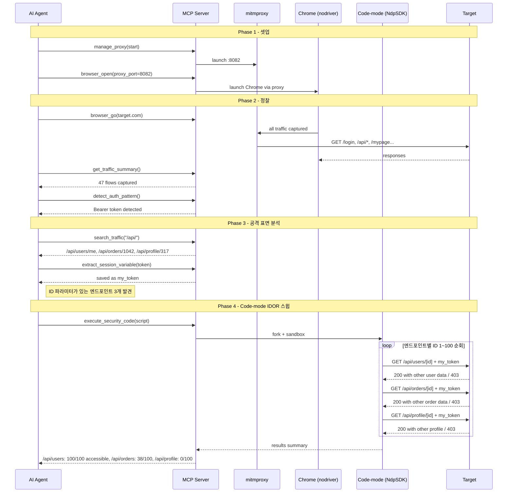

<p align="center">
  <h1 align="center">nodriver-proxy-mcp</h1>
  <p align="center">
    <strong>AI 에이전트에게 브라우저, 프록시, Python 샌드박스를 줘보세요.</strong><br/>
    사람처럼 브라우징하고, Burp처럼 가로채고, 필요한 공격 코드는 직접 짭니다.
  </p>
  <p align="center">
    <a href="https://python.org"></a>
    <a href="https://modelcontextprotocol.io"></a>
    <a href="LICENSE"></a>
  </p>
</p>

**[English](README.md)**


---

## 왜 만들었나

기존 보안 MCP 서버는 AI에게 트래픽을 **읽기만** 하게 하거나 CLI 도구를 감싸는 수준입니다. 이 도구는 **완전한 자율 제어권**을 줍니다: 에이전트가 **봇 탐지를 우회하는 브라우저**를 열고, 모든 요청을 **MITM 프록시**로 캡처하고, 내장 도구로 부족하면 **Python을 직접 짜서 실행**합니다.

```
"target.com에서 IDOR 취약점을 찾아줘"

  1. 에이전트가 프록시 + 브라우저 시작
  2. 로그인 페이지로 이동, 인증 정보 입력, 제출
  3. 인증 플로우를 캡처하고 JWT 추출
  4. 다른 사용자 ID로 API 요청을 재전송
  5. Python 스크립트를 작성해 전체 IDOR 체크 자동화
  6. 취약한 엔드포인트 리포트
```

사람이 키보드를 만질 필요가 없습니다. 에이전트가 39개 MCP 도구로 전부 처리합니다.


---

## 왜 펜테스터에게 좋은가

### Burp / ZAP이 못하는 걸 뭘 할 수 있나?

| | Burp Suite / ZAP | nodriver-proxy-mcp |
|---|---|---|
| **누가 조작?** | 사람이 직접 클릭 | AI가 전부 자율 수행 |
| **봇 탐지** | Cloudflare, DataDome 등에 차단됨 | 자동 우회 (nodriver) |
| **스크립팅** | 확장/매크로를 직접 작성 | AI가 Python을 즉석에서 작성, SDK로 38개 도구 접근 |
| **클라이언트 데이터** | 안 보임 | localStorage, sessionStorage, JS 콘솔, 히든 인풋 전부 읽음 |
| **같이 쓸 수 있나?** | — | 가능 — `upstream="localhost:8080"`으로 Burp 체이닝 |

### 다른 보안 MCP 서버와 뭐가 다른가?

대부분의 보안 MCP 서버는 `curl` 래퍼이거나 읽기 전용 트래픽 뷰어 수준입니다. 이 도구는:

- **진짜 mitmproxy** — 트래픽 기록, 리플레이, 퍼징, 인터셉트 규칙, 세션 변수. 간소화된 HTTP 클라이언트가 아닙니다.
- **트래픽 수정이 2가지** — 브라우저 레벨 (즉각, CDP Fetch) 또는 프록시 레벨 (시스템 전체, 모든 HTTP 클라이언트). 다른 MCP는 둘 다 없습니다.
- **SDK 포함 코드 모드** — AI가 샌드박스에서 실행되는 Python을 작성하고, 29개 도구를 `asyncio` 루프로 호출. Race condition, Blind SQLi, 브루트포스가 MCP 왕복 수천 번 걸릴 작업을 수 초 만에 완료.

### 이런 것에 강합니다

| 용도 | 에이전트가 어떻게 처리하나 |
|------|--------------------------|
| **IDOR** | 브라우저 2개(victim + attacker) 열고, 토큰 추출, 사용자 ID를 바꿔가며 루프로 리플레이 |
| **XSS** | 입력 필드에 페이로드를 타이핑하고 클릭, `alert()` 다이얼로그가 뜨는지 확인. DOM 분석으로 주입점 탐지. |
| **인증 우회** | 트래픽을 스캔해서 JWT / API key / 세션 쿠키 패턴 감지, 토큰 추출, 수정해서 리플레이 |
| **API 테스트** | 모든 API 호출 캡처, 키워드/상태코드 검색, regex 치환 리플레이, 이상 탐지 퍼징 |
| **Race condition** | 코드 모드에서 `asyncio.gather()`로 50+ 동시 요청을 정밀 타이밍으로 전송 |
| **Blind SQLi** | 코드 모드에서 바이너리 서치 추출 — 수백 개 조건부 요청을 로직과 함께 실행 |
| **CSP 우회** | 브라우저 레벨에서 응답을 인터셉트, Chrome이 적용하기 전에 CSP 헤더를 제거/수정 |


---

## 아키텍처

### 전체 시스템



### 이중 인터셉트 레이어



> **CDP Fetch** = 브라우저 전용, 즉각 적용, 세션별. **mitmproxy 규칙** = 모든 트래픽, ~5초 캐시 지연, 시스템 전체.

### 프로세스 수명 관리

| 프로세스 | 부모 | IPC 방식 | 자동 정리 |
|---------|------|---------|----------|
| **mitmproxy** | MCP 서버 | SQLite (공유 파일) | Watchdog 스레드가 부모 사망 감지 후 종료; stderr 드레인으로 파이프 행 방지 |
| **BrowserDaemon** | MCP 서버 | TCP JSON-RPC (동적 포트) | 부모 PID 감시 → IPC close → SIGTERM → SIGKILL |
| **Chrome** | BrowserDaemon | CDP (Chrome DevTools Protocol) | 데몬 종료 시 `browser.stop()` 호출 |
| **코드 모드 스크립트** | MCP 서버 | 환경변수 (포트, 세션 정보) | Job Object / `killpg`; 256MB RAM, 60초 CPU 제한 |


---

## NdpSDK — 코드 모드 Python SDK

`NdpSDK`는 동일한 38개 도구(프록시 + 브라우저)를 async 메서드로 제공하는 Python 래퍼로, `execute_security_code` 안에서 사용하도록 만들어졌습니다. 개별 MCP 호출로는 비효율적인 루프, 동시 요청, 다단계 로직이 필요할 때 AI가 `NdpSDK`를 사용하는 스크립트를 작성합니다.

```python
from nodriver_proxy_mcp.sdk import NdpSDK
import asyncio

async def main():
    sdk = NdpSDK()  # 실행 중인 프록시 + 브라우저 세션 자동 감지

    flows = await sdk.get_traffic_summary(limit=20)
    await sdk.browser_go("https://target.com/admin")

    # 루프 — 이것이 NdpSDK의 존재 이유
    for uid in range(1, 100):
        resp = await sdk.replay_flow(
            flow_id,
            replacements=[{"regex": r"/users/\d+", "replacement": f"/users/{uid}"}]
        )
        if resp["status_code"] == 200:
            print(f"IDOR: /users/{uid}")

asyncio.run(main())
```


---

## 빠른 시작

### 1. 설치

```bash
pip install nodriver-proxy-mcp
```

또는 소스에서:

```bash
git clone https://github.com/BobongKu/nodriver-proxy-mcp.git
cd nodriver-proxy-mcp
pip install .
```

### 2. AI 에이전트에 등록

**MCP 클라이언트** (`mcp_config.json`):

```json
{
  "mcpServers": {
    "nodriver-proxy-mcp": {
      "command": "nodriver-proxy-mcp"
    }
  }
}
```

### 3. 사용

AI 에이전트에게 하고 싶은 걸 말하면 됩니다. 도구 설명이 충분해서 에이전트가 알아서 선택합니다.


---

## 전체 39개 도구

### 프록시 (18)

| 도구 | 용도 |
|------|------|
| `manage_proxy` | 프록시 시작/중지. `upstream`으로 Burp 체이닝. `ui=True`로 GUI. |
| `proxy_status` | 실행 상태, 포트, PID 확인 |
| `set_scope` | 캡처 대상 도메인 제한 |
| `get_traffic_summary` | 페이지네이션된 플로우 목록 (ID, URL, 메서드, 상태코드) |
| `inspect_flow` | 전체 요청/응답 상세 — 헤더, 바디, 메타데이터 |
| `search_traffic` | 키워드, 도메인, 메서드, 상태코드 필터 검색 |
| `extract_from_flow` | JSONPath, regex, CSS 셀렉터로 값 추출 |
| `extract_session_variable` | `{{placeholder}}` 재사용을 위한 값 저장 |
| `list_session_variables` | 추출된 모든 변수 조회 |
| `generate_curl` | 플로우를 복사-붙여넣기 가능한 curl 명령으로 내보내기 |
| `replay_flow` | regex 치환 + `{{var}}` 자동 대입으로 재전송 (Burp Repeater 스타일) |
| `send_raw_request` | 원시 HTTP 요청 직접 전송 (SSRF 차단 내장) |
| `add_interception_rule` | 실시간 프록시 트래픽 조작: 헤더 주입, 바디 치환, 차단 |
| `list_interception_rules` | 활성 프록시 규칙 조회 |
| `remove_interception_rule` | ID로 프록시 규칙 삭제 |
| `detect_auth_pattern` | JWT, Bearer, API key, 세션 쿠키, CSRF, OAuth2 자동 감지 |
| `fuzz_endpoint` | 동시 퍼징 + 베이스라인 이상 탐지 |
| `clear_traffic` | 트래픽 DB 초기화 |

### 브라우저 (20)

| 도구 | 용도 |
|------|------|
| `browser_open` / `browser_close` | Chrome 세션 시작/종료 (안티봇 우회, 기본 headless) |
| `browser_list_sessions` | 활성 세션 목록 (PID, 포트, 가동시간) |
| `browser_list_tabs` | 세션 내 탭 목록 |
| `browser_go` / `browser_back` | 네비게이션, 페이지 로드 대기, `wait_for`로 SPA 지원 |
| `browser_click` | CSS 셀렉터 또는 텍스트로 클릭. JS alert 다이얼로그 반환 (XSS 탐지). |
| `browser_type` | 입력 필드에 텍스트 입력 — 로그인 폼, 검색창, 페이로드 주입 |
| `browser_get_dom` | 보안 중심 DOM: 폼, 스크립트, iframe, 주석, 이벤트 핸들러, `data-*` 속성 |
| `browser_get_text` | CSS 셀렉터의 텍스트 콘텐츠 |
| `browser_get_storage` | localStorage + sessionStorage 덤프 (프록시에 안 보임) |
| `browser_get_console` | JS 콘솔 출력 — 스택 트레이스, 디버그 URL, CSP 위반 |
| `browser_screenshot` | 페이지 PNG 캡처 — 봇 챌린지, 증거, 상태 확인 |
| `browser_set_cookie` | CDP로 쿠키 설정 (httpOnly 지원 — document.cookie와 달리) |
| `browser_js` | 페이지 컨텍스트에서 임의 JavaScript 실행 |
| `browser_wait` | 요소/텍스트 출현 대기 (SPA/AJAX 지원) |
| `browser_intercept_request` | CDP Fetch: 헤더 주입, 요청 차단 (즉각 적용) |
| `browser_intercept_response` | CDP Fetch: 응답 바디 치환, 응답 차단 (즉각 적용) |
| `browser_intercept_disable` | CDP Fetch 인터셉트 전체 해제 |
| `browser_list_intercept_rules` | 활성 CDP Fetch 규칙 조회 |

### 코드 모드 (1)

| 도구 | 용도 |
|------|------|
| `execute_security_code` | `NdpSDK`로 38개 도구에 접근하는 AI 생성 Python 실행. 리소스 제한 샌드박스. |


---

## Burp Suite 연동

`upstream`으로 mitmproxy를 Burp에 체이닝해서 AI 자동화와 수동 분석을 동시에 할 수 있습니다:

```
manage_proxy(action="start", upstream="localhost:8080")
```

트래픽 흐름: `Chrome --> mitmproxy (:8082) --> Burp Suite (:8080) --> 타겟`

양쪽 도구가 같은 트래픽을 봅니다. AI가 자동화하고, 정밀 분석이 필요할 때 Burp에서 확인합니다.


---

## 워크플로우 — Code-mode IDOR 자동 스윕




---

## 문제 해결

| 문제 | 해결 |
|------|------|
| 브라우저 실행 실패 | Chrome/Chromium 설치 필요. `nodriver`는 실제 Chrome 바이너리가 필요합니다. |
| SSL 인증서 에러 | mitmproxy CA 신뢰 등록: `~/.mitmproxy/mitmproxy-ca-cert.pem` |
| 포트 사용 중 | `manage_proxy(port=XXXX)` — 또는 재시작 시 고아 프로세스 자동 정리 |
| 도구가 안 보임 | Claude Code / Cursor 세션 재시작으로 MCP 서버 리로드 |
| `uvx` 안 됨 | `uvx` 대신 레포 클론 후 `uv run --directory` 사용 |


---

## 라이선스

MIT
